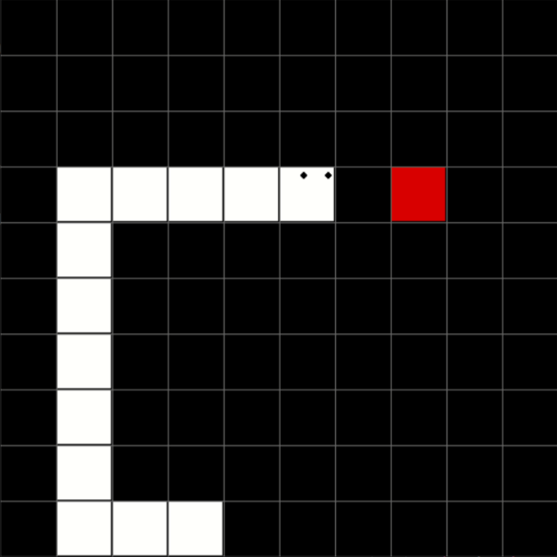

# Snakes in AI

This is part of my course project for the course of Machine Learning. In this project I decided to use my previous librabry for Neural Networks - Python ported version of [Toy Neural Network Librabry by Dan Shiffman](https://www.youtube.com/playlist?list=PLRqwX-V7Uu6aCibgK1PTWWu9by6XFdCfh)
Thus by using PyGame Library and the Neural Network Librabry the Snake AI is trained to dodge walls, avoid eating its own body and eat his snacks.
The neural network architecture for the snake is (8,15,9,4)\

# Inputs
The snake requires 8 inputs for its working which are : wall to left, wall infront, wall right, angle to food, tail on left, tail on right, tail front, energy left:
- **1-3** Inputs are boolean inputs ie.(1/0) based on if wall is to its left,infront or right respectively.
- **4** Input is normalized angle between the snakes heads moving direction and snacks position, it is negative if food is to right and positive if food is to left.
- **5-7** Inputs are boolean inputs ie.(1/0) based on if tail of snake is to its left,infront or right respectively.
- **8** Input is snakes energy left, I used this energy because I saw my snake just moving forward and backward without consuming any snack, thus by constantly decreasing the energy of snake when moving and replenishing its energy when it eats a snack seemed to work.

# Outputs
The snake brain outputs an array of chances it should turn either left, right, up or down. By knowing which output is highest, the snake turns to that perticular direction

# Dependencies
Although majority of the library codes were written from scratch in this project, to run the program you must have:
- Python 3.6
- PyGame v1.9.6

# How To Run
To run the code, I have presented 3 versions:
- Non AI Snake game: Esentially just a snake game with keyboard Inputs, file name is snake.py
- AI for Training: It is the code to train the snake to play the game based on genetic algorithm, file name snake_AI_genetic.py
- AI Product: It is the final game based on the training which reads the saved brain from the training and uses it to determine the turns, file name is snake_AI.py
